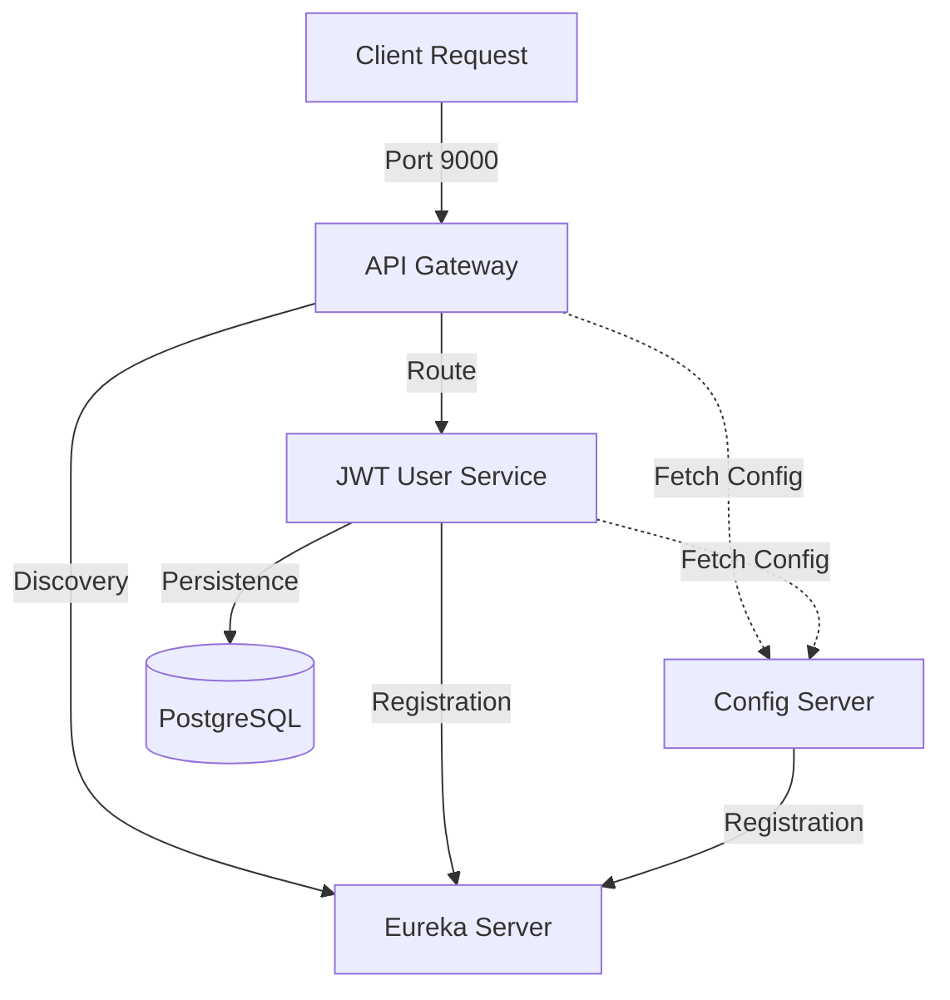

# 🛡️ Java Spring Boot Microservices Template (v1.0.0)

[](https://spring.io/projects/spring-boot)
[](https://spring.io/projects/spring-cloud)
[](https://www.oracle.com/java/technologies/downloads/#java21)
[](LICENSE)

A high-performance, modular, and production-ready microservices architecture designed for modern cloud environments. This template leverages the latest Spring Boot technologies to provide a robust foundation for building scalable distributed systems.

---

## 🏛️ Architecture Overview

Our architecture follows the **Centralized Configuration & Service Discovery** pattern, ensuring seamless communication and management across the ecosystem.



### 🧩 Core Components

| Service | Port   | Description |
| :--- |:-------| :--- |
| **Eureka Server** | `8761` | Service Registry where all microservices "handshake" to enable discovery. |
| **Config Server** | `8888` | Central hub for external configuration, serving properties to all services. |
| **API Gateway** | `9000` | The unified entry point. Handles load balancing and intelligent routing. |
| **JWT User Service** | `8080` | Identity & Access Management (IAM) handling registration and token generation. |
| **Example Service** | `8081` | Example business service used for demos and integration tests (configured in `config-files/example-service.yml`). |

---

## ⚡ Key Features

- **🚀 Cutting Edge Stack**: Built on Java 21, Spring Boot 4.0.5, and Spring Cloud 2025.1.1.
- **🛡️ JWT Authentication**: Secure user management with authentication protocols and token-based security.
- **⚙️ Centralized Configuration**: Manage application settings in one place (`config-files/`).
- **🔍 Service Discovery**: Automatic registration and discovery using Netflix Eureka.
- **🔀 Smart Routing**: Spring Cloud Gateway for flexible, non-blocking API management.
- **🐘 Database Ready**: Pre-configured support for PostgreSQL with JPA/Hibernate.
- **🏗️ Clean Architecture**: Decoupled domain logic from infrastructure (Hexagonal/Ports & Adapters).

---

## 🛠️ Getting Started

### 📋 Prerequisites

- **Java 21 Development Kit (JDK)**
- **Maven 3.8.0+**
- **PostgreSQL** (running on port 5432)
- **Git**

### 🏁 Setup Guide

1.  **Clone the Repository**
    ```bash
    git clone https://github.com/jorge00ESP/java-backend-default-project.git
    cd java-backend-default-project
    ```

   2.  **Start Services in Order** (Crucial for discovery)

    >    [!IMPORTANT]
    >    **Order matters!** Wait approximately 10-15 seconds between starting each service.

       From the project root, open a separate terminal for each service and run the commands:

       1.  **Eureka Discovery Service**
           ```bash
           cd eureka-service && ./mvnw spring-boot:run
           ```
       2.  **Config Management Service**
           ```bash
           cd config-service && ./mvnw spring-boot:run
           ```
       3.  **API Gateway Service**
           ```bash
           cd api-gateway-service && ./mvnw spring-boot:run
           ```
       4.  **JWT User Service**
           ```bash
           cd jwt-user-service && ./mvnw spring-boot:run
           ```
       5.  **Example Service**
           ```bash
           cd example-service && ./mvnw spring-boot:run
           ```

## 🛡️ Security & Authentication

The **JWT User Service** manages authentication using a secure token-based approach.

### 🔑 Authentication Endpoints

| Endpoint | Method | Description |
| :--- | :--- | :--- |
| `/api/auth/register` | `POST` | Create a new user account. |
| `/api/auth/login` | `POST` | Authenticate and receive a JWT token. |

> [!TIP]
> Use the Gateway port (`9000`) to access these endpoints. The gateway will automatically route the request to the `jwt-user-service` instance.

---

## 🔌 Example Service Endpoints

The `example-service` exposes the following REST endpoints (available through the API Gateway at `http://localhost:9000/api/example/...`):

| Endpoint | Method | Description |
| :--- | :---: | :--- |
| `/api/example/category` | `GET` | List all categories |
| `/api/example/category` | `POST` | Create a new category (body: CategoryDto) |
| `/api/example/furniture` | `GET` | List all furniture items |
| `/api/example/furniture/{id}` | `GET` | Get furniture by id |
| `/api/example/furniture` | `POST` | Create a furniture item (body: FurnitureDtoRequest) |
| `/api/example/furniture/price` | `PUT` | Update furniture price (body: FurniturePriceDtoRequest) |
| `/api/example/furniture/{id}` | `DELETE` | Delete furniture by id |

Note: these endpoints are routed by the API Gateway (`/api/example/**`), and in the service security configuration they may require authentication depending on your profile (see `example-service` security settings).


---

## 🛠️ Error handling

The project uses a unified response format for all APIs via the utility class `ApiResponse`. The standard response structure returned by endpoints is:

```json
{
  "status": 200,
  "message": "Descriptive message",
  "body": {}
}
```

- Domain errors: controllers and business logic throw `CustomException` when an expected error occurs (business validation, entity not found, etc.). The `GlobalExceptionHandler` captures `CustomException` and responds with the `status` and `message` provided by the exception.
- Unexpected errors: any uncaught exception is handled by a global handler that returns `500 Internal Server Error` and a generic message to avoid leaking sensitive information.

Recommended best practices:
- Throw `CustomException` with an appropriate HTTP status (4xx/5xx) for expected errors.
- Validate inputs and return clear messages in `message` to make client debugging easier.
- Do not expose stack traces or sensitive information in public responses.

Example in `example-service`:

- `GlobalExceptionHandler` defines two handlers: one for `CustomException` that uses the exception's status, and one for `Exception` that returns `500`.

---

## 🔐 About the `common-security` project

`common-security` is a shared library module designed to centralize JWT security utilities and filters reusable across microservices. Main features:

- `JwtUtils`: JWT generation and validation, extraction of username and roles.
- `JwtAuthenticationFilter`: a filter that reads the `Authorization: Bearer <token>` header, validates the token and populates the `SecurityContext` with the user and their `GrantedAuthority`.
- `SecurityAutoConfiguration`: auto-configuration that provides `JwtUtils` and `JwtAuthenticationFilter` beans (it includes a disabled-by-default `FilterRegistrationBean` so each service can register the filter according to its security pipeline).

Usage notes:
- The default `secret` and `expiration` are defined in `JwtUtils` (it's recommended to override these via service configuration or provide a custom `JwtUtils` bean).
- The module's `pom.xml` declares `spring-boot-starter-security` and `spring-boot-starter-web` with `provided` scope: consuming microservices must declare the required dependencies in their own `pom.xml`.
- To enable JWT authentication in a service, register the `JwtAuthenticationFilter` in that service's security configuration (or enable the `FilterRegistrationBean` as needed).

Quick integration steps for a microservice:

1. Add `common-security` as a dependency.
2. Configure the `secret` and token expiration (for example in `application.yml` or by injecting a custom `JwtUtils` bean).
3. Register `JwtAuthenticationFilter` in the Spring Security filter chain for protected routes.

This allows services to share JWT handling and role extraction logic, ensuring consistent authentication and authorization across microservices.

## 📁 Directory Structure

```text
├── api-gateway-service/   # Routing & Load Balancing
├── config-service/        # Cloud Config Server
├── eureka-service/        # Netflix Eureka Discovery
├── jwt-user-service/      # Authentication & User Management
├── config-files/          # Centralized YAML configurations
└── pom.xml                # Parent orchestration (if applicable)
```

---

## 🐘 Database (PostgreSQL) with Docker

This project includes a convenience Docker Compose file to run a local PostgreSQL instance used by the services for development and tests. The compose file is located at `postgres-db-docker/docker-compose.yml` and exposes the database on the default port `5432`.

Default credentials (as configured in the compose file):

- POSTGRES_USER: postgres
- POSTGRES_PASSWORD: postgres
- POSTGRES_DB: postgres

Start the database (from the project root):

```bash
cd postgres-db-docker
docker compose up -d
```

Notes:

- The database data is persisted in a named volume `postgres_data` (see compose file).
- If you change credentials or DB name, make sure to update the corresponding `config-files/*.yml` entries so services can connect.
- For production use consider using managed DB services or hardened container configurations; this compose file is intended for local development only.


**Last Updated:** April 6, 2026 | **Version:** 1.0.0  
*Maintained by jorge00ESP*
